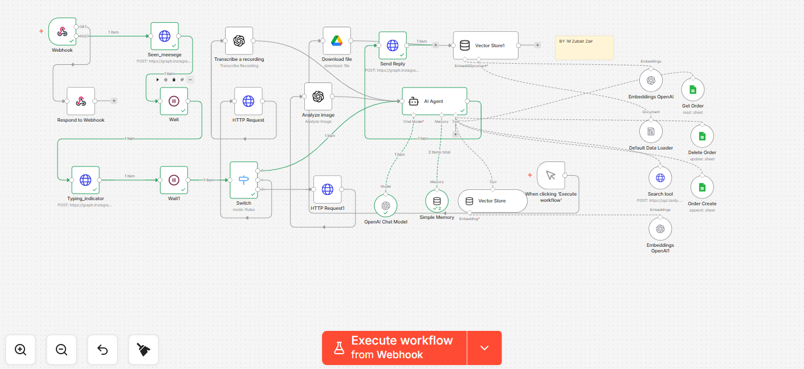

### AI-Powered E-commerce Sales & Customer Support Automation Agent

#### Overview

This project is an advanced automated agent designed to manage e-commerce customer support and sales operations through Instagram DMs using **n8n** and **Agentic AI**. It bridges the gap between customer queries and order fulfillment, ensuring high-speed interactions and operational accuracy.

#### The Challenge

E-commerce brands often struggle with the manual labor required to handle high volumes of customer inquiries, including product recommendations, order processing, and payment verification. This inefficiency frequently results in delayed response times, missed sales opportunities, and significant operational overhead.

#### The Solution

This workflow functions as an intelligent sales and support assistant. It integrates directly with Instagram to automate repetitive tasks while incorporating a "human-in-the-loop" mechanism to ensure oversight for critical business decisions.

#### Key Features

* **Intelligent Query Handling:** Processes customer inquiries via Instagram DMs with context-aware responses.
* **Adaptive Recommendations:** Suggests relevant product alternatives when requested items are out of stock.
* **Knowledge Retrieval:** Analyzes real-time product data to ensure information accuracy.
* **Order Lifecycle Management:** Automates the creation, updating, and cancellation of orders.
* **Secure Payment Verification:** Validates payments before confirming order processing.
* **Human Oversight:** Escalates complex or sensitive cases to human operators for review and final approval.

#### Tech Stack

* **Automation Platform:** n8n
* **AI Engine:** OpenAI API
* **Integrations:** Instagram API, Meta API, CRM Systems
* **Core Concepts:** Webhooks, Order Management Automation, Payment Verification Workflows

#### Workflow Architecture

#### Business Impact

* **Operational Efficiency:** Achieves 24/7 instant customer support, drastically reducing manual workload.
* **Conversion Optimization:** Accelerates order processing speeds, directly contributing to higher sales conversion opportunities.
* **Scalability:** Provides a consistent customer experience that grows alongside business demands without increasing headcount.

#### Setup Instructions

1. Download the `e-commerce-automation.json` file from this repository.
2. Open your **n8n** dashboard and select "Import Workflow."
3. Configure your credentials for **OpenAI API**, **Instagram/Meta API**, and your internal **CRM**.
4. Activate the workflow to manage your Instagram sales and support channels autonomously.
